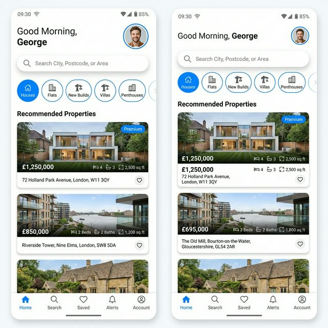

# NestHaven 🏡

NestHaven is a premium, beautifully-designed UK property search application built with Flutter. It provides users with an elegant interface to discover homes for sale or rent, calculate complex mortgages (including UK Stamp Duty and interest-only options), and save favourite properties locally.

Designed with a focus on high-end aesthetics, smooth micro-animations, and immediate performance.



## ✨ Features
*   **Property Discovery:** Browse beautifully rendered property cards with high-quality images, detailed stats (EPC, floor area, bed/bath count), and price reduction badges.
*   **Advanced Mortgage Calculator:** Built-in UK calculator supporting Repayment vs. Interest-only, adjustable terms (up to 40 years), initial interest rates, and precise **UK Stamp Duty** calculations (First-time buyer, Next home, Second/Additional home).
*   **Search & Filtering:** Dynamic, horizontal category chips and text search (City, Postcode) to narrow down results.
*   **Local Storage (Hive):** Save favourite properties instantly to local storage. They persist across app restarts without requiring cloud authentication.
*   **Interactive Maps:** Visualise properties on an interactive Google Map with custom markers *(requires API key)*.
*   **Smooth Animations:** Staggered list reveals, shared-axis transitions, and subtle shimmer loading effects powered by `flutter_animate`.

## 🛠 Tech Stack
*   **Framework:** Flutter (Dart)
*   **State Management:** Riverpod (`flutter_riverpod`, `riverpod_annotation`)
*   **Local Database:** Hive (`hive`, `hive_flutter`) for rapid, synchronous NoSQL storage.
*   **Mapping:** Google Maps Flutter
*   **UI/UX:** Custom design system, Google Fonts (Bricolage Grotesque), `flutter_animate` for micro-interactions, `carousel_slider_plus` for galleries.

## 🚀 Getting Started

### Prerequisites
*   Flutter SDK (3.27.0 or higher)
*   Dart SDK (3.6.0 or higher)
*   Xcode (for iOS) / Android Studio (for Android)

### Setup Instructions

1.  **Clone the Repository**
    ```bash
    git clone https://github.com/georgeikwegbu/nest_haven.git
    cd nest_haven
    ```

2.  **Install Dependencies**
    ```bash
    flutter pub get
    ```

3.  **Generate Riverpod & Hive Code**
    *(Not required immediately as generated files are checked in, but run this if you modify any models or providers)*
    ```bash
    flutter pub run build_runner build --delete-conflicting-outputs
    ```

### Google Maps API Key Configuration

To enable the Map Search feature, you must provide your own Google Maps API Key.

**Android:**
Open `android/app/src/main/AndroidManifest.xml` and replace `YOUR_GOOGLE_MAPS_API_KEY` with your actual key:
```xml
<meta-data
    android:name="com.google.android.geo.API_KEY"
    android:value="YOUR_GOOGLE_MAPS_API_KEY" />
```

**iOS:**
Open `ios/Runner/AppDelegate.swift` and insert your API key:
```swift
GMSServices.provideAPIKey("YOUR_GOOGLE_MAPS_API_KEY")
```

### Running the App
Run the app on a connected device or simulator:
```bash
flutter run
```

## 🧪 Testing
The project includes a comprehensive suite of Unit and Widget tests ensuring calculation accuracy (especially the complex UK mortgage formulas) and UI stability.

Run all tests:
```bash
flutter test
```

## �� Folder Structure
```text
lib/
├── core/               # Shared constants, formatters, theme, router
├── features/           # Feature slices (Domain-Driven Design)
│   ├── favourites/     # Saved properties feature
│   ├── map/            # Google Maps integration
│   ├── mortgage_calculator/ # Complex calculation logic & UI
│   ├── onboarding/     # Initial welcome screens
│   ├── profile/        # User settings & preferences
│   ├── property_detail/# Listing deep-dive views
│   └── search/         # Home screen, search results, property models
└── main.dart           # App entry point and Hive initialization
```

## 📄 License & Credits
Designed and engineered by **George Ikwegbu**.
For inquiries or collaborations, please view my portfolio at [https://gikwegbu.netlify.app/](https://gikwegbu.netlify.app/).
