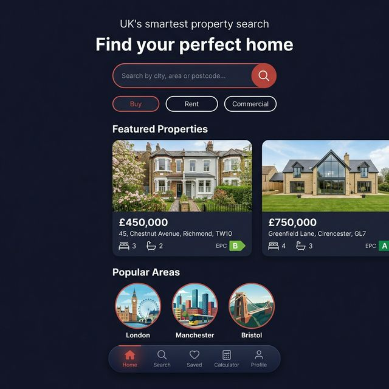
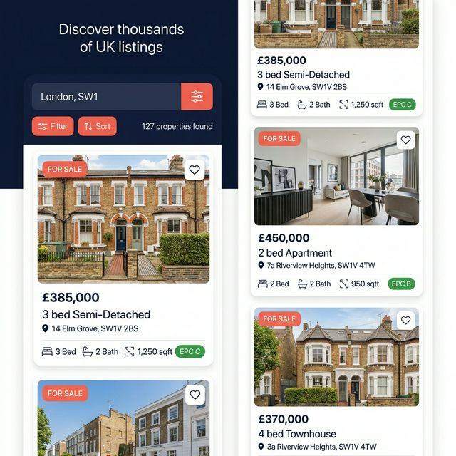
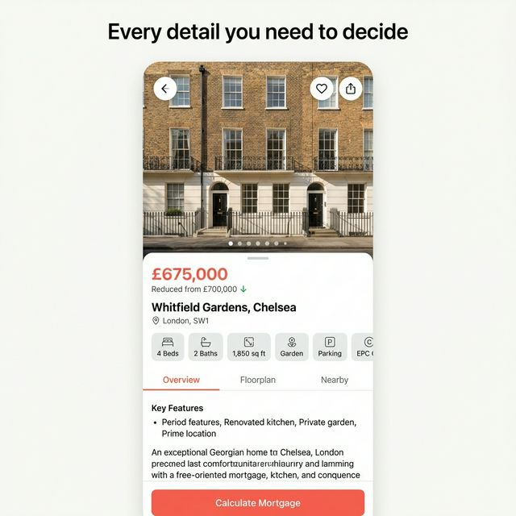

# NestView 🏠

> **UK's Smartest Property Search & Mortgage Calculator**

A premium Flutter mobile application for finding, tracking, and financing UK properties. Built for first-time buyers, renters, and property investors across England, Scotland, and Wales.

---

## Screenshots

| Home | Search Results | Property Detail |
|------|---------------|-----------------|
|  |  |  |

---

## Features

- 🔍 **Smart Search** — Search by city, area, or postcode with advanced filters (price, bedrooms, property type, EPC rating, garden, parking, commute time)
- 🗺️ **Map Search** — Full-screen Google Maps view with polygon draw-to-search mode
- 🏡 **Property Detail** — Full-screen image gallery, key stats, floorplan tab, nearby amenities, agent contact
- ❤️ **Favourites** — Save properties, swipe to remove, share your saved list, get price-drop alerts
- 🧮 **Mortgage Calculator** — Monthly repayment, LTV indicator, amortisation chart, affordability checker, UK stamp duty (standard, first-time buyer, second home)
- 📊 **Area Insights** — Price trends, crime index, school ratings, transport links
- 👤 **Profile** — Buyer preferences, notification toggles, saved calculations

---

## Tech Stack

| Layer | Technology |
|-------|-----------|
| SDK | Flutter 3.x (Dart 3.x) |
| State Management | Riverpod v2 (`flutter_riverpod`) |
| Navigation | GoRouter |
| Local Storage | Hive (`hive_flutter`) |
| Maps | Google Maps Flutter |
| Charts | FL Chart |
| Images | Cached Network Image |
| Animations | Flutter Animate |
| Typography | Google Fonts (Nunito Sans + Bricolage Grotesque) |

---

## Prerequisites

- **Flutter SDK** ≥ 3.16.0 ([Install guide](https://docs.flutter.dev/get-started/install))
- **Dart SDK** ≥ 3.0.0
- **Xcode** ≥ 15 (for iOS builds — macOS only)
- **Android Studio / SDK** (for Android builds)
- A **Google Maps API key** ([Get one here](https://developers.google.com/maps/documentation/android-sdk/get-api-key))

---

## Setup & Installation

### 1. Clone the repository

```bash
git clone https://github.com/GIkwegbu/nest_view.git
cd nest_view
```

### 2. Install dependencies

```bash
flutter pub get
```

### 3. Configure Google Maps API Key

#### Android
Open `android/app/src/main/AndroidManifest.xml` and add inside the `<application>` tag:

```xml
<meta-data
    android:name="com.google.android.geo.API_KEY"
    android:value="YOUR_GOOGLE_MAPS_API_KEY" />
```

NB: Please, for security purpose, do not check in your API Keys to version control, instead add it to the local.properties, load it in the build.gradle, and then call it up in the AndroidManifest.xml Don't say I didn't do anything for you 🥲

##### Step 1 — Add the key to `local.properties`

Open `android/local.properties` (this file is already gitignored by default). Add your key at the bottom:

```properties
MAPS_API_KEY=your_actual_api_key_here
```

##### Step 2 — Load the key in `android/app/build.gradle.kts`

At the **top** of the file, before the `android {}` block, add:

```kotlin
import java.util.Properties

val localProperties = Properties()
val localPropertiesFile = rootProject.file("local.properties")
if (localPropertiesFile.exists()) {
    localPropertiesFile.inputStream().use { localProperties.load(it) }
}
```
Then inside `android { defaultConfig { ... } }`, add:

```kotlin
android {
    defaultConfig {
        // ... your existing config
        manifestPlaceholders["MAPS_API_KEY"] = localProperties.getProperty("MAPS_API_KEY") ?: ""
    }
}
```

##### Step 3 — Reference the key in `AndroidManifest.xml`
```xml
<meta-data
    android:name="com.google.android.geo.API_KEY"
    android:value="${MAPS_API_KEY}" />
```
---

#### iOS
Open `ios/Runner/AppDelegate.swift` and update:

```swift
import GoogleMaps

@UIApplicationMain
@objc class AppDelegate: FlutterAppDelegate {
  override func application(
    _ application: UIApplication,
    didFinishLaunchingWithOptions launchOptions: [UIApplication.LaunchOptionsKey: Any]?
  ) -> Bool {
    GMSServices.provideAPIKey("YOUR_GOOGLE_MAPS_API_KEY")
    GeneratedPluginRegistrant.register(with: self)
    return super.application(application, didFinishLaunchingWithOptions: launchOptions)
  }
}
```

NB: Secure the API keys in iOS too:
##### Step 1 — Create `ios/Flutter/secrets.xcconfig`

Create a **new file** at `ios/Flutter/secrets.xcconfig` and add:

```
MAPS_API_KEY=your_actual_api_key_here
```

##### Step 2 — Add `secrets.xcconfig` to `.gitignore`

In your root `.gitignore`, add:

```gitignore
# iOS secrets (contains API keys — never commit)
ios/Flutter/secrets.xcconfig
```
##### Step 3 — Import secrets into Xcode config files

Open `ios/Flutter/Debug.xcconfig` and add at the top:

```
#include "secrets.xcconfig"
#include "Generated.xcconfig"
```


Open `ios/Flutter/Release.xcconfig` and do the same:

```
#include "secrets.xcconfig"
#include "Generated.xcconfig"
```

> ⚠️ The `#include "secrets.xcconfig"` line **must come before** `Generated.xcconfig`.


##### Step 4 — Expose the key via `Info.plist`

Open `ios/Runner/Info.plist` and add inside the root `<dict>`:

```xml
MAPS_API_KEY
$(MAPS_API_KEY)
```

##### Step 5 — Read the key in `AppDelegate.swift`

Open `ios/Runner/AppDelegate.swift` and update it to:

```swift
import Flutter
import UIKit
import GoogleMaps

@main
@objc class AppDelegate: FlutterAppDelegate {
  override func application(
    _ application: UIApplication,
    didFinishLaunchingWithOptions launchOptions: [UIApplication.LaunchOptionsKey: Any]?
  ) -> Bool {
    let key = Bundle.main.object(forInfoDictionaryKey: "MAPS_API_KEY") as? String ?? ""
    GMSServices.provideAPIKey(key)
    GeneratedPluginRegistrant.register(with: self)
    return super.application(application, didFinishLaunchingWithOptions: launchOptions)
  }
}
```

--- 

Also add to `ios/Runner/Info.plist`:

```xml
<key>NSLocationWhenInUseUsageDescription</key>
<string>NestView uses your location to show nearby properties and calculate commute times.</string>

<key>NSLocationAlwaysAndWhenInUseUsageDescription</key>
<string>NestView uses your location to show nearby properties and calculate commute times.</string>
```

### 4. Run the app

```bash
# Debug mode
flutter run

# Specific device
flutter run -d "iPhone 15 Pro"
flutter run -d "Pixel 8"
```

---

## Build for Release

### Android (AAB for Play Store)

```bash
flutter build appbundle --release
# Output: build/app/outputs/bundle/release/app-release.aab
```

### iOS (for App Store)

```bash
flutter build ipa --release
# Then upload via Xcode Organizer or Transporter
```

---

## Project Structure

```
lib/
├── core/
│   ├── constants/      # AppColors, AppStrings, AppConstants
│   ├── router/         # GoRouter configuration (app_router.dart)
│   ├── theme/          # AppTheme (Material 3), AppTextStyles
│   ├── utils/          # CurrencyFormatter, MockData
│   └── widgets/        # Shared: AppLoadingWidget, AppErrorWidget, AppEmptyWidget
│
├── features/
│   ├── onboarding/     # Splash + Onboarding screens
│   ├── search/         # Home, Search Results, PropertyCard, FilterBottomSheet
│   │   ├── models/     # PropertyModel, PropertyPreviewModel, SearchFilterModel
│   │   ├── viewmodels/ # searchResultsProvider, searchQueryProvider, etc.
│   │   ├── views/      # home_screen.dart, search_results_screen.dart
│   │   └── widgets/    # property_card.dart, filter_bottom_sheet.dart
│   ├── property_detail/ # PropertyDetailScreen
│   ├── map_search/     # MapSearchScreen (Google Maps + polygon draw)
│   ├── favourites/     # FavouritesScreen (Hive-backed)
│   ├── mortgage_calculator/ # MortgageCalculatorScreen
│   ├── area_insights/  # AreaInsightsScreen (charts)
│   └── profile/        # ProfileScreen (Hive-backed preferences)
│
└── main.dart           # App entry point, Hive init, ProviderScope

test/
├── unit/               # Unit tests (ViewModel logic, formatters, models)
└── widget/             # Widget tests (UI rendering and interaction)

storeFiles/
├── appstore/           # iPhone 6.5" App Store screenshots
└── playstore/          # Google Play Store screenshots
```

---

## Environment Notes

- **Mock data** is used for all property listings — no backend API is required to run the app in development.
- To plug in a real API, replace `MockData` calls in `search_viewmodel.dart` with your HTTP client.
- Hive boxes are created automatically on first run.

---

## App Store Details

| | |
|--|--|
| **Bundle ID** | `com.gikwegbu.nest_view` |
| **App Store Category** | Real Estate |
| **Play Store Category** | House & Home |
| **Minimum iOS** | iOS 13.0 |
| **Minimum Android** | API 21 (Android 5.0) |

---

## License

```
MIT License

Copyright (c) 2026 George Ikwegbu

Permission is hereby granted, free of charge, to any person obtaining a copy
of this software and associated documentation files (the "Software"), to deal
in the Software without restriction, including without limitation the rights
to use, copy, modify, merge, publish, distribute, sublicense, and/or sell
copies of the Software, and to permit persons to whom the Software is
furnished to do so, subject to the following conditions:

The above copyright notice and this permission notice shall be included in
all copies or substantial portions of the Software.

THE SOFTWARE IS PROVIDED "AS IS", WITHOUT WARRANTY OF ANY KIND, EXPRESS OR
IMPLIED, INCLUDING BUT NOT LIMITED TO THE WARRANTIES OF MERCHANTABILITY,
FITNESS FOR A PARTICULAR PURPOSE AND NONINFRINGEMENT. IN NO EVENT SHALL THE
AUTHORS OR COPYRIGHT HOLDERS BE LIABLE FOR ANY CLAIM, DAMAGES OR OTHER
LIABILITY, WHETHER IN AN ACTION OF CONTRACT, TORT OR OTHERWISE, ARISING FROM,
OUT OF OR IN CONNECTION WITH THE SOFTWARE OR THE USE OR OTHER DEALINGS IN THE
SOFTWARE.
```

---

## Author

**George Ikwegbu** — Senior Flutter / Mobile Engineer

- 🌐 [gikwegbu.netlify.app](https://gikwegbu.netlify.app/)
- 💼 [linkedin.com/in/GIkwegbu](http://linkedin.com/in/GIkwegbu)
- 🐦 [x.com/GIkwegbu](https://x.com/GIkwegbu)

---

*NestView — Built with ❤️ in Flutter*
